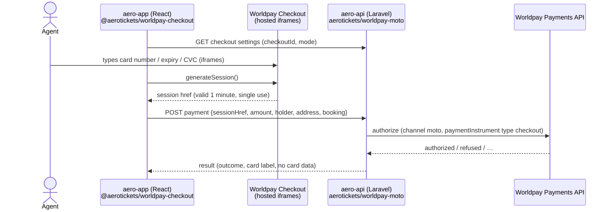

# Checkout sessions (recommended)

This is the **priority payment flow for Aero Tickets**. The agent types the card details into Worldpay-hosted
fields inside the SPA. Worldpay turns them into a short-lived **session**, and aero-api authorizes the payment
with that session. **The card number, expiry and CVC never reach aero-api, its database or its logs.**

← [Laravel](laravel.md) · Next: [Authorizing payments](authorizing-payments.md)

## The flow



| Step | Where | Package |
|---|---|---|
| Show the card fields, create the session | Browser | `@aerotickets/worldpay-checkout` ([docs](../../worldpay-checkout-js/README.md)) |
| Authorize with the session, then settle / refund / … | aero-api | this SDK |

## Server side (aero-api)

### 1. Expose the browser settings

```php
Route::get('admin/worldpay/checkout-settings', fn () => response()->json(Worldpay::checkoutSettings()));
// → {"checkoutId":"…","mode":"try"}
```

The Checkout ID is public: it identifies your Checkout integration, not your account credentials. The Payments
API username and password stay on the server.

### 2. Accept the session and authorize

```php
use AeroTickets\Worldpay\Exceptions\OutcomeUnknown;
use AeroTickets\Worldpay\Exceptions\WorldpayException;
use AeroTickets\Worldpay\Laravel\Facades\Worldpay;
use AeroTickets\Worldpay\Payments\Instrument\CheckoutSession;
use AeroTickets\Worldpay\Payments\Request\Address;
use AeroTickets\Worldpay\Payments\Request\AuthorizeRequest;
use AeroTickets\Worldpay\Support\Money;
use AeroTickets\Worldpay\Support\TransactionReference;

public function store(Request $request, File $file)
{
    $data = $request->validate([
        'session_href' => 'required|string|max:2048',
        'amount' => 'required|decimal:0,2|min:0.01',
        'holder_name' => 'required|string|max:255',
        'address' => 'required|string|max:80',
        'city' => 'required|string|max:50',
        'postcode' => 'required|string|max:15',
        'country' => 'required|string|size:2',
    ]);

    $reference = TransactionReference::generate('AT'.$file->id);

    // Save a pending record BEFORE calling Worldpay, so an unknown outcome can be reconciled
    $payment = $file->cardPayments()->create(['transaction_reference' => $reference, 'status' => 'pending', ...]);

    try {
        $result = Worldpay::payments()->authorize(
            AuthorizeRequest::moto($reference, Money::fromDecimal($data['amount'], 'GBP'))
                ->paymentInstrument(CheckoutSession::card(
                    $data['session_href'],
                    cardHolderName: $data['holder_name'],
                    billingAddress: Address::of($data['address'], $data['city'], $data['country'], $data['postcode']),
                ))
                ->orderReference((string) $file->id)
                ->narrative(line2: 'FILE '.$file->id)
        );
    } catch (OutcomeUnknown $e) {
        $payment->update(['status' => 'unknown']);      // reconcile later; do NOT ask for the card again blindly
        throw $e;
    } catch (WorldpayException $e) {
        $payment->update(['status' => 'error', 'error' => $e->getMessage()]);
        throw $e;
    }

    $payment->update([
        'status' => $result->outcome->value,            // authorized, refused, …
        'payment_id' => $result->paymentId(),
        'worldpay_handle' => $result->handle()->toJson(),
        'card_label' => $result->card()?->label(),      // "visa •••• 2701"
        'summary' => $result->toArray(),                // card-safe audit summary
    ]);

    return response()->json([
        'outcome' => $result->outcome->value,
        'needs_review' => $result->needsReview(),
        'card' => $result->card()?->label(),
    ]);
}
```

### Rules

- **Authorize immediately.** A card session is valid for **one minute** and can be used **once**. The SPA should
  create it on submit, and the API should use it in the same request. If the session expired or was already used,
  Worldpay returns a 400 error. Ask the SPA to create a new session; the agent doesn't need to retype the card.
- **Don't store the session href,** and don't log it. The SDK redacts it from its own logs.
- **Don't validate the session format.** Worldpay says its structure may change. Treat it as an opaque string.
- **Everything after authorization is the same** for every instrument: settle, cancel, refund and the rest. See
  [Managing payments](managing-payments.md).

## Paying with a saved card (token + CVC session)

When the customer pays again with a card stored as a Worldpay token, the agent types only the CVC. The browser
package turns it into a **CVC session**, valid for 15 minutes and single use:

```php
use AeroTickets\Worldpay\Payments\Instrument\WorldpayToken;

->paymentInstrument(WorldpayToken::href($storedTokenHref)->withCvcSession($cvcSessionHref))
```

To create the token in the first place, add `->createToken()` to the first authorization. See
[Authorizing payments](authorizing-payments.md#worldpay-token).

## PCI DSS scope

| | Plain card through aero-api | Checkout session |
|---|---|---|
| Card data passes through aero-api servers | **Yes** | No |
| Card data in the database / logs | Possible (it happens today) | Impossible |
| Typical self-assessment for the servers | SAQ D (heaviest) | Much lighter: confirm the exact SAQ with your QSA or acquirer |
| Agent desktops / phone line | In scope | **Still in scope**: the agent still hears and types the card |

Checkout removes your **servers** from card-data scope. It doesn't remove the call centre: agent PCs, browsers and
call recordings (pause recording while the card is read out) are still part of your PCI assessment.

## Testing it

- Unit tests: `WorldpayFake` doesn't care which instrument you use. See [Testing](testing.md).
- End to end in Try:
  - **Automated:** set `WORLDPAY_TRY_CHECKOUT_ID` and run `composer test:integration`. A server-side
    `CheckoutSessionFactory` creates the session from a test card. That's for Try only.
  - **Manual, through a real browser:** use the demo page in the JS package (`examples/vite-demo`), then authorize
    the session it shows.
